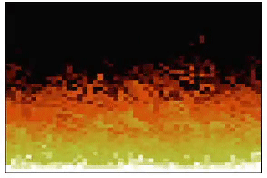

<h1 align="center">Doom Fire algorithm</h1>

<p align="center">Made with @filipedeschamps tutorial video (https://www.youtube.com/watch?v=fxm8cadCqbs)</p>

<p align="center">
  
</p>

### 🛠️ Technology utilized

- [Javascript](https://www.javascript.com/)

### 🔽 Cloning the repository
```bash
$ git clone <https://github.com/victorsantos895/doomfire.git>
```

### 🖥️ Start the application

Open the doomFire.html archive